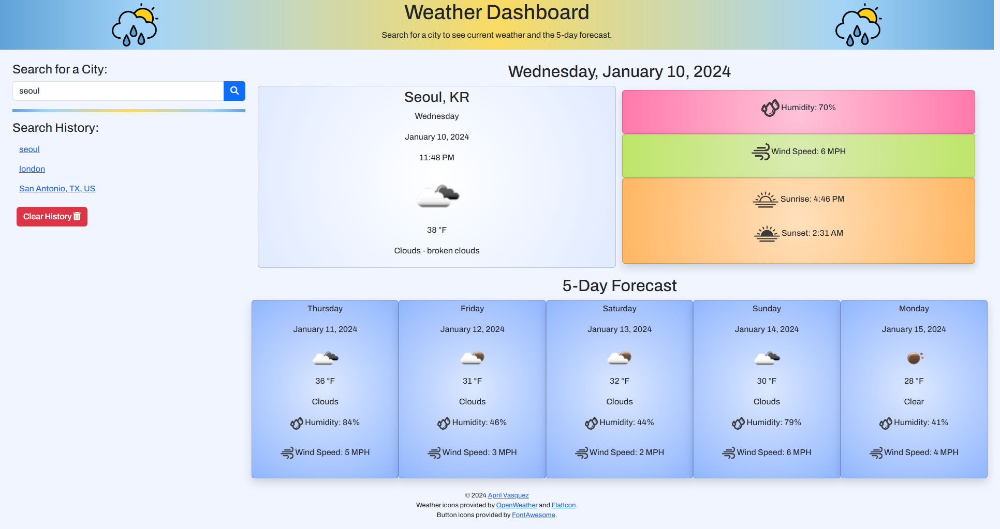

 
 
<i>View a city's current weather and 5-day forecast</i>

## Description

Upon page load, the weather data will populate with the last search or "San Antonio, TX". Weather searches should use this format: city, state (optional), country (optional). User will be alerted when the search is unsuccessful (e.g. empty input or non-existent city). Successful searches will be saved to the search history using local storage and then the current weather and 5-day forecast will display. Search history links can be clicked on to revisit weather info or it can be cleared using the reset button.

**Current weather contains:**

* City/State, Country name
* Day, date, and time
* Weather icon representing the current weather conditions
* Temperature in Fahrenheit (°F)
* Description of current weather condition (e.g. Clear, Clouds, Fog, Thunderstorm)
* Humidity
* Wind speed
* Sunrise and sunset times

**Each day in the 5-day forecast contains:**

* Day and date
* Weather icon representing the weather condition
* Temperature in Fahrenheit (°F)
* Description of current weather condition (e.g. Clear, Clouds, Fog, Thunderstorm)
* Humidity
* Wind speed

## Features

* [OpenWeather:](https://www.openweathermap.org) retrieve current weather and 5-day forecast data
* [Fetch:](https://developer.mozilla.org/en-US/docs/Web/API/Fetch_API) obtain data from HTTP responses (e.g. obtain the weather data from OpenWeather)
* [DayJS:](https://day.js.org/) format and display dates and time
* [JQuery:](https://jquery.com) simplify DOM traversal and event handling
* [Bootstrap:](https://www.getbootstrap.com) CSS framework for styling

## Deployment

Visit the website: [Weather Dashboard](https://apri1mayrain.github.io/weather-dashboard/)

## Screenshot

## Credits

**Weather icons:**

* [OpenWeather](https://www.openweathermap.org)
* [Flaticon](https://www.flaticon.com)

**Button icons:**

* [Fontawesome](https://fontawesome.com)

## License

MIT License - Copyright © 2024 april1mayrain